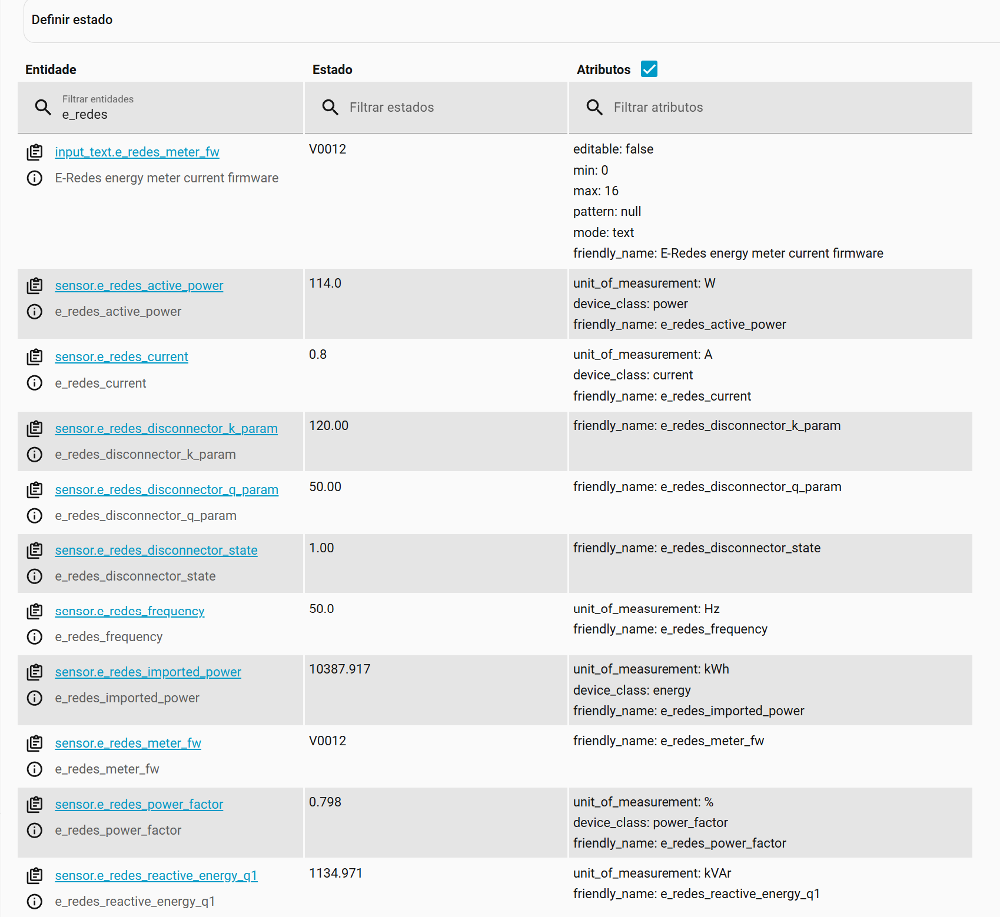

# home-assistant-hanbus
Home Assistant component for modbus devices with large registers


## Overview

This project begins as a fork of the modbus built-in integration from Home Assistant core. The scope here is to provide an
integration eclectic enough to cover the customizations and extensions to the original protocol, while leveraging the custom
data type, allowing any sequence of bytes in the modbus payload to be converted to a Python struct.

This project aims to bring back the ability to handle registers of arbitrary length, and potentially other features that 
may be in violation of the original Modbus protocol, but which are de facto present in real world equipment.

## The EDP HAN bus

The particular case that motivated the introduction of this custom integration project was the Portuguese smart meter InovGrid scenario. 
When the utility company EDP started planning the transition to an all digital smart meter network,it decided that the 
communication between the equipment and the user client, as well as other equipment in the grid, had to follow strict 
protocol guidelines that they defined in this document:

[DEF-C44-509.pdf](docs/specs/DEF-C44-509.pdf)

This specification takes the Modbus specification as the baseline, and complies with it regarding the structuring of the frames and all 
the definitions related to the communication, but extends it by allowing individual registers to have a variable length, instead of the 
fixed 16 bits of the original Modbus specification.

The EDP HAN specification does not define a specific limit to how many bytes a single register can have, but the ultimate constraint 
is the 256 bytes maximum length of the Modbus frame.

### Structure of the request / response:

Request:

| Byte 0        | Byte 1                 | Byte 2                 | Byte 3                            | Byte 4                           |
|:--------------|:-----------------------|:-----------------------|:----------------------------------|:---------------------------------|
| Function code | Starting Address (MSB) | Starting Address (LSB) | Quantity of Input Registers (MSB) |Quantity of Input Registers (LSB) |

Response:

| Byte 0        | Byte 1         | Byte 2      | Byte 3          |   Byte 4    | ...       | Byte n      |
|:--------------|:---------------|:------------|:----------------|:------------|:----------|-------------|
| Function code | Byte Count (m) | Data byte m | Data byte m - 1 | ...         | ...       | Data byte 0 |

Constraints:

```
n < 256 bytes
m <= n - 2
m % 2 == 0
```

According to the HAN specification, if m (register size), is not an even number, then the value needs to be padded with an extra byte (0x00) at the end.

## Installation

### HACS (recommended)

Have [HACS](https://hacs.xyz/) installed, this will allow you to update easily.

<a href="https://my.home-assistant.io/redirect/hacs_repository/?owner=AlexandrErohin&repository=home-assistant-tplink-router&category=integration" target="_blank"></a>

or go to <b>Hacs</b> and search for `HANbus`.

### Manual

1. Locate the `custom_components` directory in your Home Assistant configuration directory. It may need to be created.
2. Copy the `custom_components/hanbus` directory into the `custom_components` directory.
3. Restart Home Assistant.

## Configuration

The configuration is currently based on editing the configuration.yaml file. In the future it will be possible to
use the configuration flow for simplified UX.

Basically you need to add a configuration entry to the homeassistant configuration.yaml. It will be something similar
to the example below. Replace the host and port with the correct details for your RS-485 gateway. For example the
Elfin modules normally listen in the 9988 port by default, but it can be reconfigured in its Web UI. Below are a
few sensors, but you may define more, by looking up the [HAN specification document](docs/specs/DEF-C44-509.pdf)
and selecting the address and appropriate struct to convert the value.

```
hanbus:
  - name: my_energy_meter
    type: tcp
    host: 192.168.1.156
    port: 9988
    delay: 1
    timeout: 5
    message_wait_milliseconds: 1000
    sensors:
      - name: "e_redes_voltage" # 6C
        slave: 1
        address: 108
        input_type: input
        data_type: uint16
        precision: 1
        scale: 0.1
        offset: 0
        unit_of_measurement: V
        device_class: voltage
        scan_interval: 15

      - name: "e_redes_current" # 6D
        slave: 1
        address: 109
        input_type: input
        data_type: uint16
        precision: 1
        scale: 0.1
        unit_of_measurement: A
        device_class: current
        scan_interval: 15
        
      - name: "e_redes_active_power" # 79
        slave: 1
        address: 121
        input_type: input
        data_type: custom
        count: 1
        structure: ">L"
        precision: 1
        scale: 1
        unit_of_measurement: W
        device_class: power
        scan_interval: 15
       
      - name: "e_redes_power_factor" # 7B
        slave: 1
        address: 123
        input_type: input
        data_type: uint16
        precision: 3
        scale: 0.001
        unit_of_measurement: '%'
        device_class: power_factor
        scan_interval: 15

      - name: "e_redes_frequency" # 7F
        slave: 1
        address: 127
        input_type: input
        data_type: uint16
        precision: 1
        scale: 0.1
        unit_of_measurement: Hz
        scan_interval: 15
       
      - name: "e_redes_total_off_peak" # 26
        slave: 1
        address: 38
        input_type: input
        data_type: custom
        count: 1
        structure: ">L"
        precision: 3
        scale: 0.001
        unit_of_measurement: kWh
        device_class: energy
        scan_interval: 30

      - name: "e_redes_total_peak" # 27
        slave: 1
        address: 39
        input_type: input
        data_type: custom
        count: 1
        structure: ">L"
        precision: 3
        scale: 0.001
        unit_of_measurement: kWh
        device_class: energy
        scan_interval: 30

      - name: "e_redes_total_full" # 28
        slave: 1
        address: 40
        input_type: input
        data_type: custom
        count: 1
        structure: ">L"
        precision: 3
        scale: 0.001
        unit_of_measurement: kWh
        device_class: energy
        scan_interval: 30

      - name: "e_redes_imported_power" # 16
        slave: 1
        address: 22
        input_type: input
        data_type: custom
        count: 1
        structure: ">L"
        precision: 3
        scale: 0.001
        unit_of_measurement: kWh
        device_class: energy
        scan_interval: 30

      - name: "e_redes_reactive_energy_q1"
        slave: 1
        address: 24
        input_type: input
        data_type: custom
        count: 1
        structure: ">L"
        precision: 3
        scale: 0.001
        unit_of_measurement: kVAr
        scan_interval: 30

      - name: "e_redes_disconnector_state"
        ## 0 para disconectado - 1 para conectado - 2 para preparado a reconectar
        slave: 1
        address: 132
        input_type: input
        count: 1
        data_type: custom
        structure: ">Bx"
        scan_interval: 10

      - name: "e_redes_disconnector_q_param"
        slave: 1
        address: 133
        input_type: input
        count: 1
        data_type: custom
        structure: ">L"
        scan_interval: 10

      - name: "e_redes_disconnector_k_param"
        slave: 1
        address: 134
        input_type: input
        count: 1
        data_type: custom
        structure: ">L"
        scan_interval: 10

      - name: "e_redes_tariff_l1" # Tariff
        ## 1 para Vazio - 2 para Ponta - 3 para Cheia
        slave: 1
        address: 11
        input_type: input
        count: 1
        data_type: custom
        structure: ">Bx"
        scan_interval: 30

      - name: "e_redes_meter_fw"
        slave: 1
        address: 4
        input_type: input
        count: 1
        data_type: string
        scan_interval: 30
```

If you are not familiar with the Python structs, like for example:

```
structure: ">L"
```

Take a look at this document, which explains in detail how the Python structs can be leveraged to convert byte data to any of the regular Python data types:

[Python struct](https://docs.python.org/3/library/struct.html)

Once you are done with setting up the configuration, just restart Home Assistant, and if all went well you should find your newly configured
sensors among the entities.



<!--

TODO migrate to configuration workflow:

HANbus integration is configured via the GUI. See [the HA docs](https://www.home-assistant.io/getting-started/integration/) for more details.


1. Go to the <b>Settings</b>-><b>Devices & services</b>.
2. Click on `+ ADD INTEGRATION`, search for `HANbus`.
3. Fill the modbus device details.
4. Click `SUBMIT`

-->