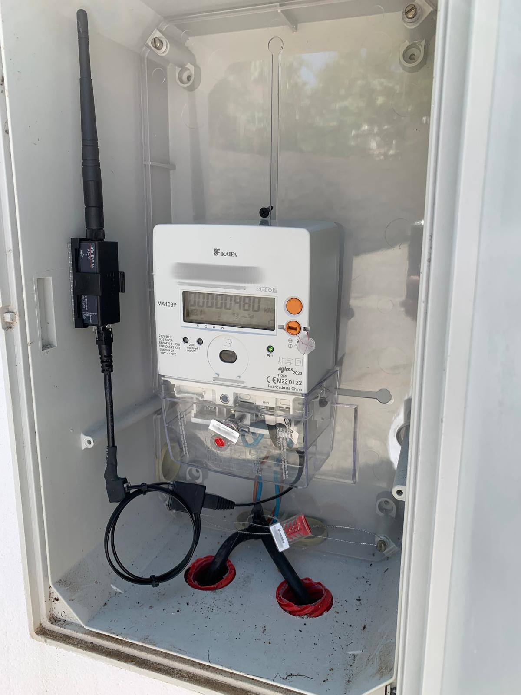
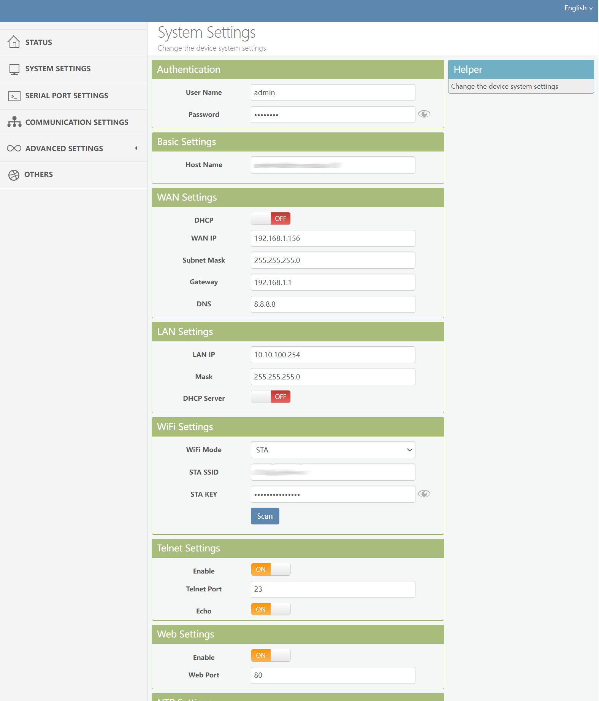
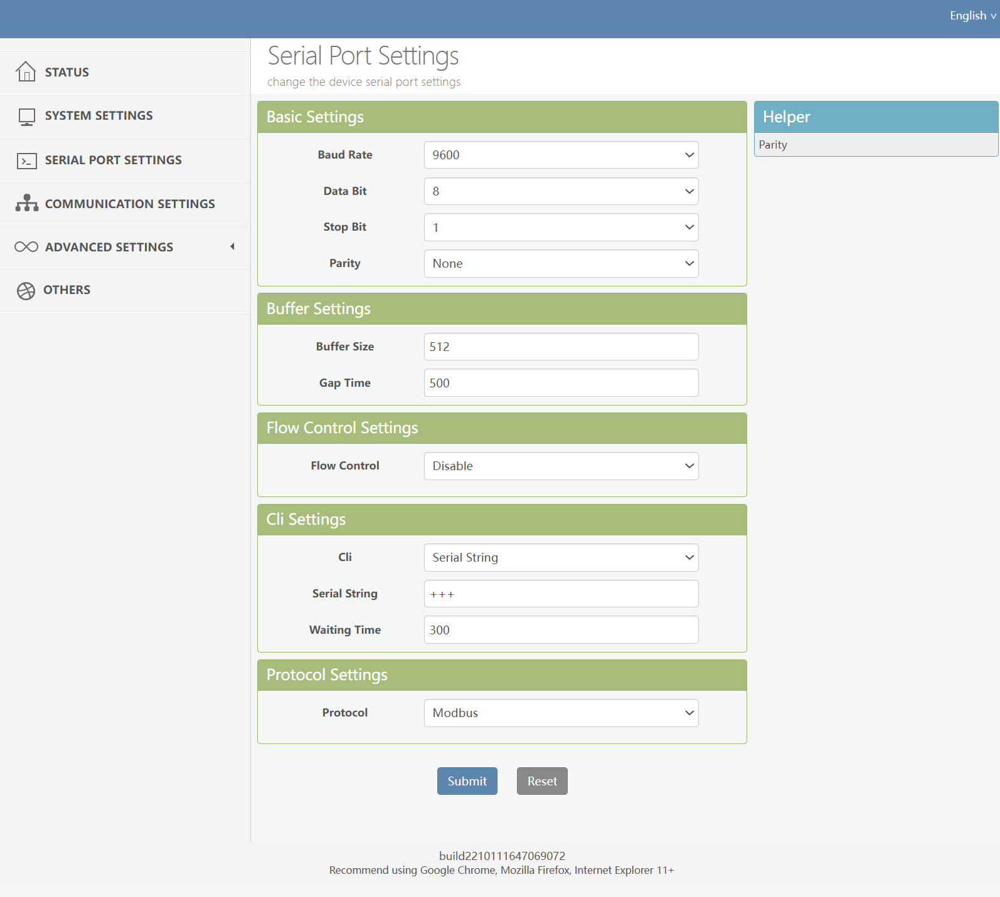
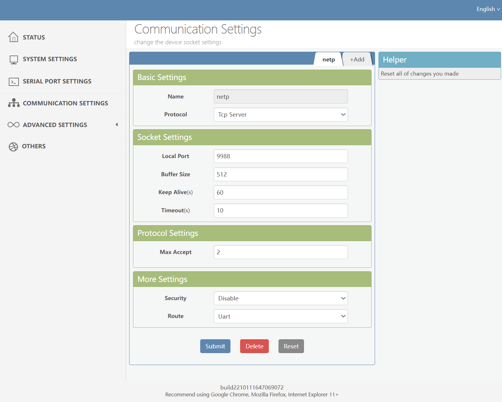

# Elfin EW11 setup for Modbus TCP

## Overview

This page describes how the Elfin EW11 module can be configured adequately for this integration.

The Elfin EW11 is a simple RS-485 to Wifi gateway providing a relatively simple way of interfacing
RS-485 devices such as PLC's, meters and other infrastructure equipment, to a TCP/IP network via WiFi.

The device is sufficiently low energy to be powered by the +5V output provided by the majority
of the meters HAN port. Normally these meters are expected to be able to deliver up to 75 - 100 mA of power.
More than that can be a stretch. This can be made worse if the meter instead of communicating 
with the power company via the power grid, the meter has to rely on a GPRS modem. In this case the 
power budget is not guaranteed to support both devices.

## Configuration

### IP configuration

First make sure you have the Elfin properly configured to communicate with your WiFi network. 
You can follow the device instructions, but normally the first time you use the device it will
be set as an AP, and you will need to connect to the WiFi network it exposes in order to 
continue the configuration. This part of the configuration is available in the "System Settings"
section of the Web UI in case you might want to return to it:

###  Serial port configuration

It is in the "Serial Port Settings" section that you will find how the RS-485 communication with
the meter needs to be set.

For most meters providing the HAN port in Portugal, the settings should be the following:

Basic settings:

 * Baud rate: 9600 bps
 * Data bits: 8
 * Stop bits: 1
 * Parity: None

Buffer settings:

 * Buffer size: 512
 * Gap time: 500

Flow Control Settings:

 * Flow control: disable

Cli Settings:

 * Cli: Serial String
 * Serial String: +++
 * Waiting Time: 300

Protocol Settings:

 * Protocol: Modbus

### Communication Settings

This section is related to exposing the Modbus / serial data via TCP.

Basic Settings:

 * Name: netp
 * Protocol: Tcp Server

Socket Settings:

 * Local Port: 9988
 * Buffer Size: 512
 * Keep Alive: 60
 * Timeout: 10

Protocol Settings

 * Max Accept: 2

More Settings:

 * Security: Disable
 * Route: Uart

